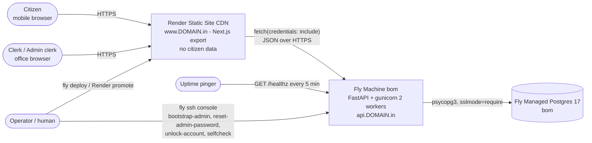
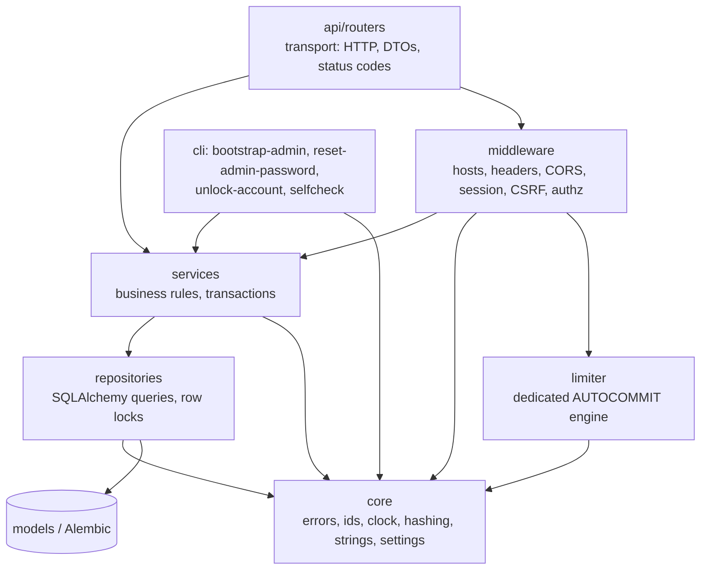

# Solution Architecture — panchayat-complaint-tracker

rev 3 (2026-09-09) · Phase: /architecture · Inputs: requirements rev 5, tech-stack rev 5.1,
UX rev 3, ADR-001…ADR-014 (all binding, none re-litigated here).
Rev 2 resolved SEC-F1…F15, ARCH-F1…F13, REL-F1…F7, PERF-F1…F3, cost-F1/F2.
Rev 3 resolves the rework-loop-2 findings SEC-S1…S9/S11, ARCH-F1…F8 (rev-3 numbering) and PERF-F5.
**Read `## Rev 2/3/4 decisions for the API and schema` before designing the contract.**

Scope of this document: drivers, complexity budget, the five constraining decisions, system
context, module boundaries, request lifecycle, business-rule enforcement map, configuration and
environments. Schema and endpoint contracts are **not** designed here — the data-api-architect
derives them from the boundaries below.

---

## Architecture drivers

Every structural decision in this folder cites one of these by ID.

| ID | Driver | Source | Consequence for the design |
|----|--------|--------|-----------------------------|
| **AD-1** | Public lookup must render a result in ≤3 s on 3G | NFR-001, AC-010 | CDN-served static shell, in-country API, ≤120 KB first-load JS, one round trip after the CSRF seed |
| **AD-2** | Minimal PII (name, phone, complaint text) must never reach the public surface or a third party | NFR-008, NFR-009, BR-005, BR-009, ADR-013 | One process holds PII; explicit public DTO with an enumerated `public_update`; no SSR, no error-tracking SaaS, no AI (ADR-012) |
| **AD-3** | The audit trail is the core deliverable and must survive concurrency | FR-011, FR-014, BR-008, BR-011, AC-003, AC-014 | Relational DB, transactional multi-row writes, append-only history tables enforced at the data-access layer |
| **AD-4** | Pilot scale: 1–5 clerks, few hundred lookups/day, <1 rps | NFR-002, product-requirements § Constraints | One machine, 2 workers, no queue, no cache, no horizontal scaling |
| **AD-5** | ≈$11–16/month total, ≤$16 approved envelope | NFR-006, ADR-009 | Free static host, smallest Fly machine + smallest managed Postgres, $0 tooling, no staging |
| **AD-6** | Ops owner is one person (the human), part-time | ADR-002 Q6, tech-stack § Ops ownership | Minimise runtimes to patch (one Python service + one base image + one npm tree); platform-managed TLS, Postgres, backups |
| **AD-7** | 99% uptime during office hours only; not 24/7 | NFR-007, ADR-009 R1 | Single instance accepted; `/healthz` + external pinger as the evidence trail; deploys outside office hours |
| **AD-8** | Complaint numbers must not be enumerable | NFR-004, NFR-005, BR-004, BR-010, ADR-008 | ≥40 random bits + checksum, POST-only lookup, per-IP limiter, number excluded from URLs/logs |
| **AD-9** | Account lifecycle happens in-app, with an on-screen one-time password | FR-017, FR-018, BR-013, BR-016 | Own session/authz layer; no auth SaaS can express it (ADR-007) |
| **AD-10** | Data residency: India / Mumbai | ADR-002 Q1, ADR-009 | API + DB in Fly `bom`; static assets (no citizen data) on Render CDN — A-T1a |
| **AD-11** | Team knows FastAPI + TypeScript/React; implementation is AI-assisted | ADR-002 Q5, tech-stack D11 | Boring layering, one tool per job, static typing as a gate, mechanisms asserted by tests not prose |
| **AD-12** | English now, Telugu later | ADR-014 Q1 | Every user-visible string in one module per side; no string literals in components/handlers |

---

## Complexity budget

Each non-trivial mechanism, KEPT with its driver or REJECTED with the reason. Nothing else exists.

1. **Server-side session table — KEPT** (AD-9: revocation on admin reset and idle expiry are unexpressible in a signed cookie; ADR-007).
2. **Postgres fixed-window rate-limit table on a dedicated AUTOCOMMIT engine — KEPT** (AD-8/NFR-005: must be correct across 2 workers without a paid Redis; ADR-008).
3. **Append-only history tables + a data-access guard hook — KEPT** (AD-3: FR-011/FR-014/BR-008 make the audit trail a Must).
4. **Post-build CSP inline-script hashing step — KEPT** (AD-2 + ADR-010 H-C: no Node process exists to mint a nonce, and `unsafe-inline` is the alternative).
5. **Scheduled Fly machine for the monthly encrypted `pg_dump` — KEPT, dormant** (AD-6/ADR-006: key holder named, destination still TBD — see open-questions OQ-2; not deployed until named).
6. **Task queue / broker / cron runner — REJECTED**: nothing is asynchronous; NFR-010 forbids auto-deletion, so there is no retention job (ADR-012 § Background jobs).
7. **Cache (Redis/Valkey/CDN API cache) — REJECTED**: <1 rps and every read is either user-specific or must be fresh; +$10/mo against AD-5.
8. **Staging environment, BFF/SSR runtime, second service, message bus, feature-flag service — REJECTED**: AD-4/AD-5/AD-6; compensating controls are CI migration dry-run, additive-only migrations and free frontend PR previews (ADR-009).
9. **One idempotency key, on complaint creation only — KEPT** (rev 2, REL-F1; driver AD-3: a retried
   `POST /api/complaints` after a 10 s client abort must not create a second record that then needs a
   Rejected-status workaround and pollutes the audit trail). A client-generated `client_request_id`
   UUID with a unique index; the server returns the existing complaint on a duplicate. **Not** a
   general idempotency-key framework, **not** applied to any other endpoint — status updates and
   edits are audited by design, so a duplicate there is visible rather than silent.
10. **`reset-admin-password` operator CLI — KEPT** (rev 2, REL-F2; drivers AD-6, AD-9: with one admin
    in practice (A12) and `bootstrap-admin` a no-op once an admin exists, there is otherwise **no**
    recovery path from a forgotten admin password. ~30 lines reusing `services.accounts`.)
11. **Per-user ceilings on PII reads and on writes, on the existing limiter — KEPT** (rev 2 SEC-F4,
    re-keyed and widened in rev 3 by SEC-S3/SEC-S4; driver AD-2 for the read ceiling, AD-3 for the
    write ceiling. The read ceiling bounds — it does not prevent — PII exfiltration through a hijacked
    clerk session; the write ceiling bounds permanent pollution of an append-only store that BR-008
    forbids cleaning up. Rev 2 keyed the read ceiling on the session, which login can mint without
    limit, and covered one of the four PII-returning routes. **Two limiter scopes only — still no new
    component.**)

---

## Decisions

The five decisions that most constrain implementation. Each names the rejected alternative.

### D-A · Authentication and authorization: opaque session cookie + deny-by-default middleware
Server-side `session` row keyed by SHA-256 of a 256-bit opaque token; `__Host-`-prefixed,
`httpOnly`, `Secure`, `SameSite=Lax`, no `Max-Age`. Authorization is a middleware that rejects
everything not in a 4-entry public allow-list (`POST /api/lookup`, `POST /api/login`,
`GET /api/session`, `GET /healthz`), plus a `require_admin_clerk` dependency on the two account
endpoints. **Rejected:** JWT in `localStorage` (not revocable, readable by ~400 npm packages) and
Auth0/Clerk (cannot express BR-016's on-screen one-time password). Binding per ADR-007. Drivers AD-9, AD-2.

### D-B · Data model core: one Postgres, mutable current-state row + append-only history
A `complaint` row carries current state; every status change and every field correction is an
**insert** into an append-only history table in the *same transaction* as the parent update, under a
row lock. The data-access layer raises on any `UPDATE`/`DELETE` targeting a history table.
**Rejected:** event-sourcing the complaint (disproportionate at AD-4) and "history is a nullable
audit column" (loses BR-011's both-writers guarantee). Drivers AD-3, AD-4. Detailed schema is the
data-api-architect's.

### D-C · API style: small JSON API, POST-for-sensitive-criteria, explicit response DTOs, additive-only evolution
**No sensitive value ever appears in a path segment or a query string** — not a complaint number, not
a citizen name, not a phone number (AD-8/AD-2: URL, referrer, browser history and the gunicorn access
log all capture them, and the never-log list would otherwise be a lie). Consequences, binding on the
contract: the public lookup is `POST /api/lookup` with the number in the body; **clerk
list/search/filter is `POST /api/complaints/search` with a JSON body** (rev 2, ARCH-F1/SEC-F3), not a
`GET` with `?q=`; the **write** endpoints are all `POST` (rev 2, ARCH-F2: no `PATCH`, so CORS stays
`GET,POST` — see the rev-2 decisions section). Path segments may carry only an opaque internal
complaint id, which is not a citizen-facing credential. Every route declares a `response_model` with
`extra="forbid"`; the clerk **list** DTO carries no `name`/`phone`, the **detail** DTO does. API
changes are additive-only so a cached frontend one version behind still works. **Rejected:**
`GET /api/complaints/{number}` and `GET /api/complaints?q=<name>` (both leak into logs, referrers and
history) and GraphQL (a second authorization surface for **15** endpoints). Drivers AD-8, AD-2, AD-1.

### D-D · Deploy model: two deployables, two human promotions, API first, no staging
Auto-deploy OFF on both; the human runs `fly deploy` from a CI-green commit (release command
`alembic upgrade head` aborts the deploy on failure), then promotes the Render static site.
Rollback is the reverse order. **Rejected:** auto-deploy from `main` (forbidden by CLAUDE.md and
ADR-009) and a staging environment (+$10–14/mo, breaks the AD-5 envelope). Drivers AD-5, AD-6, AD-7.

### D-E · Observability: stdout + `/healthz` + external pinger + `security_event` table, no SaaS
Structured JSON logs to stdout captured by the platform; `/healthz` executes `SELECT 1`; a free
external pinger every 5 min is the NFR-007 evidence; security-relevant events are rows in an
append-only Postgres table so they survive short log retention. **Rejected:** Sentry (last
third-party PII processor — AD-2, ADR-011) and a self-hosted metrics stack (costs more than the
app — AD-5). Drivers AD-2, AD-5, AD-7.

---

## System context

No other external system exists: no SMS, no email, no payment, no AI, no object storage, no
analytics, no CDN-hosted font or script (ADR-012, tech-stack § PII controls).

**Trust boundaries.** (1) Browser ↔ API is the only boundary that matters: **the API is the security
boundary**; the frontend's redirect-to-login is UX only. (2) API ↔ Postgres is inside the Fly private
network with TLS. (3) The static bundle is public by construction — route paths, field names and the
entire clerk UI are readable by anyone; obscurity is never a control (ADR-004 sec F5).

---

## Runtimes and deployables

| # | Deployable | Runtime in production | Holds citizen data | Patch owner |
|---|-----------|------------------------|--------------------|-------------|
| 1 | API | Python 3.13 in a digest-pinned `python:3.13-slim` image, gunicorn + uvicorn worker, 2 workers, 512 MB | yes (only place) | human (deps + base image) |
| 2 | Frontend | **none** — static HTML/JS/CSS on a CDN; Node 22 exists only on the build host | no | human (npm tree) |
| 3 | Database | Fly Managed Postgres 17 | yes | platform |

Three patching streams, no more (AD-6). Adding any fourth runtime is a GATE decision, not an
implementation choice.

---

## Component and module boundaries

Dependency direction is strictly downward; no arrow ever points back up.

| Module | Owns | Must not |
|--------|------|----------|
| `api/routers` | Request/response DTOs, HTTP status codes, dependency wiring | contain a business rule, touch a repository, build SQL |
| `middleware` | Host allow-list, security headers, CORS, session loading, CSRF, deny-by-default, `must_change_password`, request-ID | know about complaints or accounts |
| `services` | Every business rule, transaction boundaries, audit writes, OTP issuance, status transitions | know about HTTP (raises typed domain errors instead), import routers |
| `repositories` | Queries, row locks, uniqueness retries, pagination | enforce a rule, decide a status transition |
| `limiter` | The atomic upsert on its own AUTOCOMMIT engine, window cleanup | share the request `Session` |
| `core` | Settings, error taxonomy, complaint-number codec, clock, hashing helpers, log setup, server-side strings | import services or routers |
| `cli` | Operator entry points | be reachable over HTTP |

**Frontend ↔ backend boundary:** the OpenAPI schema is dumped in CI and `openapi-typescript`
generates a committed `api-types.ts`; CI fails when it is stale (ADR-010). That file is the only
contract; the frontend never assumes a field the schema does not declare.

---

## Request lifecycle

**Public lookup (Flow 5, the AD-1 path).**
1. CDN serves the prerendered `/` shell (no API call). Paint happens before any network round trip.
2. Hydration fires `GET /api/session` in parallel. No session cookie is presented, so the API takes
   the **anonymous variant** (R2-3): it sets a `__Host-csrfseed` cookie if absent and returns
   `{authenticated:false, csrf_token = base64url(hmac_sha256(SECRET_KEY, seed))}`. **Zero SQL
   statements on this variant** (ADR-007 H-A) — an anonymous flood can write nothing. When a session
   cookie *is* presented (the clerk app hydrating `AuthProvider`) the endpoint reads the session row
   like any authenticated request; the zero-SQL claim never covered that case.
3. Citizen submits. Client does a cheap format+checksum check (UX only) then
   `POST /api/lookup {complaint_number}` with `X-CSRF-Token`, `credentials: "include"`, 10 s `AbortController`.
4. API middleware chain: trusted host → security headers → CORS → session loader (no cookie ⇒ anonymous)
   → CSRF (stateless HMAC path) → deny-by-default (path is allow-listed) → router.
5. Limiter upsert on the AUTOCOMMIT engine, keyed by derived client IP. Over 20/min ⇒ `429`. Write
   failure ⇒ **fail closed, `503`**, no lookup.
6. Pydantic validates the number (format + checksum). Invalid ⇒ `400`/`422` with
   "Enter a valid complaint number" and **no statement touches the `complaint` table** (BR-015/AC-018).
7. Repository does one equality lookup on the normalised number. Service maps `status` →
   enumerated `public_update`. Route returns the public DTO (`complaint_number`, `status`,
   `date_logged`, `public_update`) with `Cache-Control: no-store`, `Referrer-Policy: no-referrer`.
8. Not found ⇒ `404` with the same generic wording family; no distinction leaks.

**Authenticated write (Flow 3 status update).**
1. Client sends `POST /api/complaints/{id}/status` with the session cookie and the session-bound
   `X-CSRF-Token`.
2. Middleware: session loader validates the token hash, idle window, absolute expiry, `revoked_at`;
   refreshes `last_seen_at`; sets `request.state.user`. CSRF compares with `hmac.compare_digest`.
   Deny-by-default passes (authenticated); `must_change_password` blocks everything except
   change-password, logout and `GET /api/session` with a `403` in the **standard error envelope**,
   `{"error":{"code":"must_change_password", …}}` (rev 3, ARCH-F7 — never a bare
   `{"must_change_password": true}`, which the client's single error mapper could not read).
3. Router validates the DTO and calls `ComplaintService.update_status`.
4. Service opens one transaction: `SELECT … FOR UPDATE` on the complaint row → assert the transition
   is legal (BR-002) → update current status/updated_at → **insert** the history row (previous, new,
   note, actor, timestamp) → commit. Both concurrent writers therefore keep a history row (BR-011).
5. Route returns the updated detail DTO plus the new history entry; errors map through one error model.

---

## Where each business rule is enforced

Server-side, always. The client may mirror a rule for speed; the API is the sole authority.

| Rule | Enforcement point | Mechanism |
|------|-------------------|-----------|
| BR-001 uniqueness/immutability | `repositories.complaint` + DB | `UNIQUE` index on `complaint_number`; the number is never in the updatable column set; insert retries on unique violation |
| BR-002 status flow | `services.complaints.transitions` | Explicit allowed-transition map checked inside the row-locked transaction; illegal ⇒ `422` |
| BR-003 only clerks write | `middleware` (6) deny-by-default | No public write route exists; anonymous ⇒ `401` (AC-015, parametrised over the route table) |
| BR-004 exact match only | `repositories.lookup` | Equality on the normalised number; no `LIKE`, no trigram, no suggestions |
| BR-005 public masks PII | `api.routers.lookup` response_model | Public DTO with `extra="forbid"`; `public_update` is an enum derived from `status`, never clerk text |
| BR-006 description required | request schema + DB | Pydantic `min_length=1` after strip; `NOT NULL` + `CHECK (length(trim(description)) > 0)` |
| BR-007 name/phone required | request schema + DB | same pattern |
| BR-008 no hard delete | `repositories` guard hook + absent routes | `before_execute` hook raises on `UPDATE`/`DELETE` against history tables; no delete endpoint anywhere; complaint rows are never deleted |
| BR-009 no government ID | schema shape | No such column exists; request models are `extra="forbid"`, so an injected field is a `422` |
| BR-010 no bulk public access | 4-entry public allow-list | The only public data route returns exactly one record; list/search endpoints are authenticated |
| BR-011 concurrent updates | `services.complaints` | Row lock + last-write-wins on current state + unconditional history insert for every writer; client shows a non-blocking staleness advisory |
| BR-012 phone format | `core.validation` used by the request schema | Digits, optional leading `+`, 7–15 chars |
| BR-013 admin-only account actions | `require_admin_clerk` dependency | `403` on both account endpoints for a regular clerk, including direct API calls (FR-019) |
| BR-014 max lengths | request schema + DB | name ≤100, description ≤2000; `VARCHAR`/`CHECK` mirror |
| BR-015 validate before lookup | Pydantic on the lookup request | Handler body never runs; asserted by table name with the query-counter fixture |
| BR-016 account/password rules | `services.accounts` (issuance) + `services.auth` (consumption) | Username regex + uniqueness; `validate_password` (≥12, not username-similar, not numeric, not common); 60-bit OTP returned once; `must_change_password=true`; all sessions revoked. **Single-use is enforced at login**: the OTP login overwrites `password_hash` with a discarded random value (R4-1), so the OTP cannot authenticate twice; the 72 h expiry applies while it is un-consumed |

FR coverage not restated above: FR-003/FR-004 (number generation and immediate display) →
`core.complaint_number` + create response; FR-007 (list/filter/search/paginate) →
`repositories.complaint.search` behind **`POST /api/complaints/search`** (criteria in the JSON body —
never a query string, D-C) with a status filter, an **exact-match `complaint_number` field** and a
separate **`q` `ILIKE` over name and phone** (rev 3, R3-1 — two fields, matching the two controls in
the screen inventory), plus keyset pagination of 25; FR-011/FR-014 (history) → one merged, ordered activity read; FR-012 (7-day correction window)
→ `services.complaints.edit_details` compares `created_at + EDIT_WINDOW_DAYS` server-side (the UI
disables the control, the API rejects it); FR-015 → `bootstrap-admin` CLI; FR-020 → BR-015 row.

**Every screen has a backing capability.** Public Status Lookup → `GET /api/session` (anonymous
variant) + `POST /api/lookup`. Login → `POST /api/login`. Change Password →
`POST /api/password/change`. Complaints → `GET /api/session` (authenticated variant),
`POST /api/complaints`, `POST /api/complaints/search`, `GET /api/complaints/{id}`,
`GET /api/complaints/{id}/activity`, `POST /api/complaints/{id}/status`,
`POST /api/complaints/{id}/details`. Accounts → `GET/POST /api/accounts` and
`POST /api/accounts/{id}/reset-password` behind `require_admin_clerk`. Generic 404 → static, no
capability needed. Fifteen endpoints total (R2-9), no orphans in either direction.

---

## Data flow and PII boundaries

| Data | Where it may exist | Where it must never appear |
|------|--------------------|-----------------------------|
| Citizen name, phone | Postgres; authenticated detail responses; the clerk's browser | public DTO, logs, `security_event`, backups off-platform in plaintext, any third party, the static bundle |
| Complaint description, clerk note | Postgres; authenticated responses | public DTO, logs, URLs |
| Complaint number | Postgres; request/response bodies | URLs, referrers, browser history, application logs, `security_event` |
| One-time password | one JSON response body, once | logs, `security_event`, DB in plaintext, `localStorage`, URL |
| Session token | cookie + SHA-256 hash in DB | logs, response bodies, JS-readable storage |

The static bundle contains no citizen data (A-T1a) — this is what keeps the CDN outside the AD-10
residency argument.

---

## Configuration and secrets

Twelve-factor: all configuration is environment variables; there is no config file with values in
the repo, and **no secret appears in any file in this repository or in CI**.

| Variable | Purpose | Secret | Failure if wrong |
|----------|---------|--------|------------------|
| `DATABASE_URL` | Postgres DSN; must contain `sslmode=verify-full` **if** Fly publishes a CA certificate for Managed Postgres, else `sslmode=require` with the gap recorded as accepted (SEC-F11 — decided at /release, one env change either way) | yes (`fly secrets`) | `selfcheck` refuses to start on anything weaker than `require` |
| `SECRET_KEY` | One consumer only: the anonymous CSRF HMAC. Rotatable at any time | yes | refuses to start if absent or <32 bytes |
| `USERNAME_HASH_SALT` | Sole consumer: `h(username)` for limiter keys and `security_event.actor_username_hash`. **Never rotated** (R2-11) | yes | refuses to start if absent or <32 bytes |
| `TRUSTED_PEER_CIDRS` | Peer addresses whose `Fly-Client-IP` / `X-Forwarded-For` may be believed (SEC-F1). The application is the **only** interpreter of those headers, because the server is started with a worker class that turns uvicorn's proxy-header processing **off** (ADR-023 rev 4) | no | must be explicitly set; empty ⇒ headers ignored, peer address used. A value that does not match the real Fly proxy addresses collapses every client into one bucket — see SEC-T21 case 3 and the runbook symptom |
| `FORWARDED_ALLOW_IPS` | **Must be unset.** Gunicorn reads it as the default for `forwarded_allow_ips` and passes it into the uvicorn worker's `Config`; the worker subclass overrides it to `[]`, and `selfcheck` fails if the variable is present at all (belt and braces, ADR-023 rev 4) | no | startup failure if set |
| `RATE_LIMIT_DETAIL_PER_HOUR` (120) | Per-**user** ceiling on every response carrying name/phone **or edit-history values** (R2-7, re-keyed by R3-2, widened to `/activity` by R4-2) | no | — |
| `RATE_LIMIT_SEARCH_PER_HOUR` (120) | Per-user ceiling on `POST /api/complaints/search` (R4-2) | no | — |
| `RATE_LIMIT_WRITE_PER_HOUR` (60) | Per-user ceiling on `POST /api/complaints`, `POST /api/accounts` and `POST /api/accounts/{id}/reset-password` (R3-3, extended by R4-5) | no | — |
| `MAX_REQUEST_BODY_BYTES` (65536) | Pre-parse body-size rejection ⇒ `413` (R3-6) | no | — |
| `SESSION_SWEEP_GRACE_DAYS` (7) | Global floor for the session sweep (backend §3) | no | — |
| `ENVIRONMENT` | `dev` \| `test` \| `prod` | no | dev affordances leak — `selfcheck` asserts prod |
| `ALLOWED_HOSTS` | `TrustedHostMiddleware` | no | empty or `*` in prod ⇒ startup failure |
| `CORS_ALLOWED_ORIGINS` | Exact origin allow-list | no | `*` with credentials ⇒ startup failure |
| `COOKIE_SECURE` | `__Host-` prefix + `Secure` | no | off in prod ⇒ startup failure |
| `TRUSTED_PROXY_HOPS` | Client-IP derivation | no | must be explicitly set; no implicit default |
| `RATE_LIMIT_LOOKUP_PER_MIN` (20), `LOGIN_*` thresholds | Limiter tuning without a code change | no | — |
| `SESSION_IDLE_MINUTES` (45), `SESSION_ABSOLUTE_HOURS` (9) | Session lifecycle | no | — |
| `EDIT_WINDOW_DAYS` (7) | FR-012 window | no | — |
| `OTP_EXPIRY_HOURS` (72) | BR-016 | no | — |
| `NEXT_PUBLIC_API_BASE_URL` | Frontend build-time API origin | no (public) | wrong origin ⇒ CORS/CSP failure at runtime |

Rotation: `fly secrets set` + a human-triggered redeploy. Rotating `SECRET_KEY` invalidates
outstanding anonymous CSRF seeds only — a re-fetch of `GET /api/session` recovers and no clerk is
logged out. `USERNAME_HASH_SALT` is deliberately **not** rotatable: it is the only reason the two
values are separate secrets (SEC-F12). If it ever must be rotated, the recorded side effects are
(a) every live limiter counter resets to zero, briefly removing brute-force backoff, and (b) every
historical `security_event.actor_username_hash` stops correlating with new rows — so it is a GATE
decision.

---

## Environments

| Environment | API | Frontend | Database | Notes |
|-------------|-----|----------|----------|-------|
| dev | `uvicorn --reload` :8000 | `next dev` :3000 | local Postgres 17 in Docker | unprefixed cookies over http; dev CORS origin allowed only when the dev flag is on |
| test / CI | in-process TestClient + a `live_server` fixture | exported `out/` served with the production rewrite + header rules | Postgres service container | never production data (dependency-strategy §6) |
| PR preview | — | Render preview URL | — | **not** in the CORS allow-list: a UI review tool, not a functional environment |
| prod | Fly `bom` machine | Render Static Site | Fly Managed Postgres `bom` | human-promoted, API first |

There is no staging (ADR-009). Compensating controls: CI applies `alembic upgrade head` from the
previous revision against real Postgres, `alembic check` gates drift, migrations are additive-only,
and rollback is redeploy-previous.

---

## Failure design (summary; detail in observability-reliability.md)

| Dependency | Timeout | Retry | Fallback | User sees |
|------------|---------|-------|----------|-----------|
| Postgres (request engine) | `statement_timeout` 10 s, `pool_pre_ping` | none at app level (pre-ping reconnects) | fail closed | 503 friendly page/state |
| Postgres (limiter engine) | same | none | **fail closed** — no lookup | "temporarily unavailable" |
| Browser → API | 10 s `AbortController` | user-initiated only, and **never a silent retry on `POST /api/complaints`** (R2-6: the client offers "check the list" wording; a resubmit is de-duplicated by `client_request_id`) | none | "The server is taking too long." |
| Static asset / chunk after a promotion | n/a | none | reload prompt | "A new version is available — reload" |
| Uptime pinger | 5 min interval | vendor | none | operator email |

No external service is called during a request, so there is no third-party timeout to design for
(ADR-012). That is a deliberate property, not an omission.

---

## Rev 2/3/4 decisions for the API and schema

Binding on the data-api-architect. Each closes a review finding; none is negotiable at the
contract layer without coming back here. **Later revisions win: R4-n (rev 4) supersede R3-n, which
supersede R2-n. Where a row is superseded the superseding row is named in it.**

| # | Decision | Contract / schema consequence | Finding |
|---|----------|-------------------------------|---------|
| R2-1 | **No sensitive value in a path or query string, ever.** Complaint number, citizen name and phone are body-only | `POST /api/complaints/search` (JSON body: **`{status?, complaint_number?, q?, cursor?}`** — see R3-1 for the two-field split; **no `limit`**, the page size is fixed at 25 server-side and the request model is `extra="forbid"`) replaces any `GET /api/complaints?…`; response = the same list DTO (no `name`/`phone`) + an **opaque cursor** string. `POST /api/lookup` unchanged. Path segments carry only the internal complaint id | ARCH-F1 / SEC-F3, corrected ARCH-F6 (rev 3) |
| R2-2 | **CORS methods stay `GET,POST`** — it is a selfcheck-assertable invariant. No `PATCH`, `PUT` or `DELETE` verb exists in the API | the field-correction endpoint is **`POST /api/complaints/{id}/details`**, not `PATCH /api/complaints/{id}` | ARCH-F2 / SEC-F8 |
| R2-3 | **`GET /api/session` has two response variants.** Anonymous: `{authenticated:false, csrf_token}` — the zero-SQL guarantee applies **only** to this variant (no session cookie presented). Authenticated (a session cookie is presented): `{authenticated:true, username, is_admin_clerk, must_change_password, csrf_token}` — one indexed session row read, plus the `last_seen_at` refresh, like any authenticated request | one path, two documented response shapes (a discriminated union on `authenticated`); the frontend hydrates `AuthProvider` from the second | ARCH-F3 / SEC-F9 |
| R2-4 | **Session issuance on login** (ADR-021): always mint a new token; revoke **only** the session presented in this request's cookie. Revoke-all on password change, self-reset and admin reset | no schema change; the contract must state "login always returns a new cookie" and must **not** claim other devices are logged out | ARCH-F4 / SEC-F5 |
| R2-5 | **OTP is state, not a convention.** `clerk_account.password_is_otp boolean NOT NULL DEFAULT false` and `password_set_at timestamptz NOT NULL`. Login succeeds only if `NOT password_is_otp OR now() < password_set_at + OTP_EXPIRY_HOURS`; an expired OTP returns the distinct code `otp_expired` (401) with "This one-time password has expired — ask your admin for a new one". A successful password change sets `password_is_otp=false` and `password_set_at=now()`, which is what makes the OTP single-use | two columns + one login check + one error code | SEC-F2 |
| R2-6 | **Complaint creation is idempotent by client key** (ADR-022): `complaint.client_request_id uuid NOT NULL UNIQUE`, supplied by the client on `POST /api/complaints`. On unique violation the server returns the **existing** complaint with `201`→`200` and the field **`"duplicate": true`** in the DTO (rev 3, SEC-S9 — the contract, the frontend error table and observability §6 all already say `duplicate: true`; rev 2's `duplicate_of_client_request_id` was a fourth spelling of the same flag and is dropped). Not applied to any other endpoint | one column, one unique index, one documented duplicate response carrying `duplicate: true` | REL-F1 |
| R2-7 | **Detail reads are bounded, not audited.** New limiter scope `detail`, ceiling `RATE_LIMIT_DETAIL_PER_HOUR = 120`, `429` over it. **Superseded in part by R3-2: the key is `user_id`, not the session hash, and the ceiling covers all four PII-returning routes.** **No `complaint_viewed` event type is added** (OQ-9 default stands: 1–5 known clerks, read auditing would be noise). Threat #24 is therefore **accepted**, with the walk-the-list path named | one more `rate_limit_counter` scope; no new table, no new event type | SEC-F4 |
| R2-8 | **`session.user_agent_hash` is dropped.** It was written and never checked, so it was a stored fingerprint with no control attached. If UA binding is ever wanted it comes back with a check and a test | remove the column from the session table | SEC-F14 |
| R2-9 | **Endpoint count is 15**, all of them: `GET /healthz`, `GET /api/session`, `POST /api/login`, `POST /api/logout`, `POST /api/lookup`, `POST /api/password/change`, `POST /api/complaints`, `POST /api/complaints/search`, `GET /api/complaints/{id}`, `GET /api/complaints/{id}/activity`, `POST /api/complaints/{id}/status`, `POST /api/complaints/{id}/details`, `GET /api/accounts`, `POST /api/accounts`, `POST /api/accounts/{id}/reset-password`. The public allow-list is still exactly four: `GET /healthz`, `GET /api/session`, `POST /api/login`, `POST /api/lookup` | any 16th route is a GATE decision | ARCH-F13 |
| R2-10 | **No `disabled_at` column on `clerk_account`.** Offboarding is the documented workaround: the admin runs a password reset and discards the OTP — that revokes every session for the account and leaves an unusable credential that expires in 72 h (R2-5). Recorded in security-architecture §3 and the runbook | no column; the runbook is the control | ARCH-F10 |
| R2-11 | **`USERNAME_HASH_SALT` is its own secret**, separate from `SECRET_KEY`, and is **never rotated** (rotating it orphans every limiter counter and every `security_event` actor hash, which is exactly the history the table exists to keep) | `security_event.actor_username_hash` and `rate_limit_counter.key` are stable for the life of the deployment | SEC-F12 |

### Rev 3 additions (R3-1 … R3-10)

| # | Decision | Contract / schema consequence | Finding |
|---|----------|-------------------------------|---------|
| R3-1 | **Clerk search keeps the UX's two controls as two fields in one body.** `POST /api/complaints/search` takes `{status?, complaint_number?, q?, cursor?}`. `complaint_number` is the **exact-match quick jump**: the server runs `core.complaint_number.normalise()` on it (trim, uppercase, strip `-`/spaces, `I`/`L`→`1`, `O`→`0`) and matches by **equality** on the canonical 9-symbol column. `q` is free text over **citizen name and phone only**, `ILIKE '%…%'`. Both may be sent; they AND. Rev 2's contract merged them into one `q` `ILIKE` across name/phone/number, which **cannot ever match** the hyphenated `XXXX-XXXXX` a clerk reads off a receipt against `CHAR(9)` canonical storage — FR-005/AC-005 would have failed on the happy path. Invalid checksum/format on `complaint_number` ⇒ `422 invalid_input` with `fields.complaint_number`, **before** any statement touches `complaint` (BR-015) | two optional fields, one index-equality path and one `ILIKE` path; no `limit` field; `extra="forbid"` | ARCH-F1 |
| R3-2 | **The PII-read ceiling is keyed on `user_id` and covers every route that returns name/phone**: `GET /api/complaints/{id}`, `POST /api/complaints/{id}/status`, `POST /api/complaints/{id}/details`, and the `duplicate: true` replay of `POST /api/complaints`. Ceiling stays 120/hour. Session-keying was pointless because `POST /api/login` mints unlimited sessions | limiter scope `detail`, key = `user_id`; no schema change beyond the scope value; `429` documented on all four routes | SEC-S3 |
| R3-3 | **New per-user write ceiling.** Limiter scope `write`, key = `user_id`, `RATE_LIMIT_WRITE_PER_HOUR = 60`, on `POST /api/complaints` and `POST /api/accounts`. `429` over it, new `security_event.event_type = throttle_write` | one scope value, one event-type value, `429` documented on two routes | SEC-S4 |
| R3-4 | **The OTP is consumed at the login that uses it.** ~~Clearing `password_is_otp` is the consumption step.~~ **Superseded by R4-1** — clearing the flag left the OTP's Argon2 hash valid, so the "consumed" OTP still authenticated on a second login *and* the 72 h expiry check no longer fired. Read R4-1 instead; only the direction survives | see R4-1 | SEC-S5, reopened by ARCH-F1/SEC-F2 |
| R3-5 | **A wrong current password is `422 invalid_current_password` with `fields.current_password`, never `401`.** `401 not_authenticated` means "no valid session" and nothing else, because the client maps it to a forced logout. `POST /api/password/change` also **sets a new `__Host-session` cookie** on success (revoke-all would otherwise log the clerk out of their own password change) | one new error code; the success response of password-change sets a cookie | ARCH-F3 / ARCH-F4 |
| R3-6 | **Two more mechanical facts the contract must carry:** `POST /api/logout` returns a **fresh anonymous** CSRF token (`hmac_sha256(SECRET_KEY, __Host-csrfseed)`), not a session-bound one; and every route may return `413 payload_too_large` because bodies over `MAX_REQUEST_BODY_BYTES` (64 KB) are rejected before parsing | one error code (`payload_too_large`, 413); logout's `csrf_token` documented as anonymous | ARCH-F4 / SEC-S8 |
| R3-7 | **`security_event` column names are the schema's, everywhere:** `event_type`, `actor_user_id`, `actor_username_hash`, `target_user_id`, `derived_ip`, `reason_code`, `created_at`. No document uses `actor`, `actor_hash` or `occurred_at` any more. `target_user_id` is required for admin actions (`password_reset_issued`, `account_created`) so "who reset whose password" is answerable | fixes the drift; `target_user_id` must exist on the table | ARCH-F5 |
| R3-8 | **Throttle events are written once per `(scope, key, window_start)`**, on the request where the limiter's `RETURNING count` equals `limit + 1` — not once per refused request. `security_event` is append-only and the app cannot delete from it, so per-request rows would be an attacker-driven unshrinkable table | no schema change; a stated write rule the limiter service owns, and a test (SEC-T28) | SEC-S2 |
| R3-9 | **PostgreSQL has no `DELETE … LIMIT`.** All three bounded sweeps (two session, one limiter) are written `DELETE FROM t WHERE ctid IN (SELECT ctid FROM t WHERE … LIMIT n)`, and the session sweep's idle bound comes from the `SESSION_IDLE_MINUTES` setting via `make_interval`, never a hardcoded `interval '45 minutes'`. Any migration or documented statement that shows `DELETE … LIMIT` is wrong | schema.md §sweeps must be restated in this form | ARCH-F2 |
| R3-10 | **The `rate_limit_counter(window_start)` index ships in the initial migration**, not "later if it hurts" — the scope-agnostic sweep in R3-9 scans on it from the first request | one index in migration 0001 | SEC-S6 |

### Rev 4 additions (R4-1 … R4-6) — these supersede the R3 rows they name

| # | Decision | Contract / schema consequence | Finding |
|---|----------|-------------------------------|---------|
| R4-1 | **An OTP is consumed by destroying its hash, in the login transaction.** Supersedes R3-4. When the verified password is the account's OTP, the same transaction that issues the session **overwrites `password_hash` with the Argon2 hash of a freshly generated 256-bit random value that is immediately discarded** — never stored, never returned, never logged, known to nobody — and sets `password_is_otp = false` while **keeping `must_change_password = true`**. The session issued is a must-change session (gate: change-password, logout, `GET /api/session`). Consequences, all intended: a **second** login with the same OTP fails the Argon2 verification and returns the generic **`401 not_authenticated`** (R4-4); the forced-change endpoint takes **no current password** (it is reached only from a must-change session, which the OTP login just proved), so the clerk is unaffected by the unknown hash; an abandoned session means the OTP is spent and the admin reissues one (already in the runbook). The 72 h expiry check stays live for an **un-consumed** OTP: `password_is_otp AND now() >= password_set_at + OTP_EXPIRY_HOURS` ⇒ `otp_expired`. Rev 3's marker was unusable in both directions — clearing the flag left the hash valid *and* disabled the expiry check, and `must_change_password=true AND password_is_otp=false` cannot mean "spent" because `bootstrap-admin --from-env` produces exactly that state | no new column; the login transaction performs one `UPDATE clerk_account SET password_hash = :throwaway, password_is_otp = false`; `POST /api/password/change` must be documented as **not taking `current_password` when the session is a must-change session**; the contract states an OTP is single-use at login | ARCH-F1 / SEC-F2 |
| R4-2 | **Two more PII paths come under a per-user hourly ceiling.** (a) `GET /api/complaints/{id}/activity` returns edit-history `previous_value`/`new_value`, which for `citizen_name`/`citizen_phone` edits **are** the name and the phone — it joins the existing `detail` scope (120/user/hour). (b) `POST /api/complaints/search` returns 25 records per call with `complaint_number` + `description_snippet` and was unbounded — it gets its own scope **`search`, `RATE_LIMIT_SEARCH_PER_HOUR = 120`, key `user_id`**. A clerk paging 25 rows at a time cannot reach 120 calls/hour; the ceiling bounds a bulk walk to 3 000 rows/hour, which at pilot scale is the whole table, so it bounds the **rate**, not the total — stated that way in threat #24, where the residual stays **accepted**. **The coverage rule is a table, not an introspection trick:** backend §5 carries an explicit **per-route PII classification** (route → returns name/phone? → returns other complaint content? → scope) and the API contract must carry the same table verbatim; test SEC-T29 reads it. Rev 3's "every route whose `response_model` declares `citizen_name`" missed both of these because neither declares that field | one new limiter scope value (`search`), one new config value, `429` documented on `/activity` and `/search`, and the per-route PII table in the contract | SEC-F3 |
| R4-3 | **`POST /api/complaints` counts against both `write` and `detail`, both pre-handler.** Chosen over "count `detail` in the post-handler only when the response is a `duplicate: true` replay", because a pre-handler pair is one dependency ordering with no branch, and the cost — a normal creation also spends one `detail` token — is irrelevant at 60 writes/hour against a 120/hour read ceiling. Closes ARCH-F2 (rev 3 left it ambiguous whether the replay was counted, and a post-handler decrement/increment had no owner) | both scopes listed on that one route in the contract; two `429` causes documented with distinct `reason_code`s | ARCH-F2 |
| R4-4 | **`invalid_credentials` is not an error code in this system and must not appear in the contract or the schema.** Every failed login — unknown user, wrong password, spent OTP — returns **`401 not_authenticated`** with the one generic message (that identical-response property is threat #30's control). The only login-specific code is `otp_expired` (401), for an un-consumed OTP past its window | the error-code enum stays exactly: `invalid_input`, `not_found`, `not_authenticated`, `invalid_current_password`, `payload_too_large`, `otp_expired`, `must_change_password`, `forbidden`, `rate_limited`, `service_unavailable`, `conflict` — no `invalid_credentials` | ARCH-F3 |
| R4-5 | **Two limiter/audit corrections.** (a) `POST /api/accounts/{id}/reset-password` joins the **`write`** scope: it is an admin-triggered permanent state change (revoke-all + a new credential) and was the one write route with no ceiling. (b) **`login_failure` rows are bounded**: at most **one row per `(actor_username_hash, derived_ip, 15-minute window)`**, and once the tier-1 throttle for that key is active (`count > limit`) **no further rows are written at all**. Arithmetic in observability §2 | `write` scope documented on a third route; no schema change for (b) — it is a write rule the security-event service owns, with the same shape as R3-8 | ARCH-F4 / SEC-F4 |
| R4-6 | **The `security_event.event_type` enum gains `throttle_search`** (R4-2's scope needs its own crossing event, exactly like `throttle_detail` and `throttle_write`). No other new event type, and specifically still **no `complaint_viewed`** (OQ-9) | one enum value | SEC-F3 |

**Superseded statements in documents this folder does not own** (ARCH-F5 — the owning agent must amend
them; they are wrong as written, and no implementer should follow them):

- `.ai/ux/screen-inventory.md:62` still describes a wrong **current** password as a session-ending
  error. It is a **field-level** `422 invalid_current_password` on the current-password field
  (R3-5), and on the forced-change screen there is no current-password field at all (R4-1).
- `.ai/technology/technology-comparison.md:747` still shows the forced-change response as a bare
  `{"must_change_password": true}` body. It is the standard envelope
  `{"error":{"code":"must_change_password",…}}` with status `403` (rev 3, ARCH-F7).
- `.ai/technology/tech-stack.md:804` and `:1126` (and `technology-comparison.md:731`,
  `tech-stack.md:537`) still show the start command and middleware order with uvicorn
  `--proxy-headers --forwarded-allow-ips`. Superseded by ADR-023 rev 4: the worker class
  `app.worker.RawPeerWorker` with `proxy_headers=False`, no flags, `FORWARDED_ALLOW_IPS` unset.

## ADR proposals for GATE_5

| Proposed | Decision | Alternative rejected |
|----------|----------|----------------------|
| ADR-015 | Modular monolith: routers → services → repositories, dependencies downward only, business rules only in services | Rules in routers (untestable without HTTP) / a shared "utils" layer that everything imports |
| ADR-016 | Complaint number = 8 Crockford-base32 symbols from `secrets` (40 bits) + 1 weighted checksum symbol, displayed `XXXX-XXXXX`; validated before any DB access | Sequential/short numbers (enumerable) / UUID (unreadable over the phone) |
| ADR-017 | Concurrency: `SELECT … FOR UPDATE` on the complaint row, last-write-wins current state, unconditional history insert; staleness surfaced as a non-blocking advisory | Optimistic version column with a 409 (blocks a clerk mid-call for no audit gain — UX decision 4) |
| ADR-018 | One error model: typed domain errors → a single envelope `{error:{code,message,fields}}` with stable machine codes the client maps to strings | Ad-hoc `HTTPException(detail=...)` per route (untranslatable, AD-12) |
| ADR-019 | Session idle window fixed at **45 min** within ADR-007's 30–60 range; absolute 9 h | 30 min (clerks re-login during a phone call) / 60 min (weakest end of the approved range) |
| ADR-020 (rev 2) | Client IP: **both `Fly-Client-IP` and `X-Forwarded-For` are read only when the immediate peer address is inside the configured Fly-proxy address set** (`TRUSTED_PEER_CIDRS`); otherwise both headers are discarded and the peer address itself is the limiter key. `TRUSTED_PROXY_HOPS` still gates the XFF fallback. Asserted by security test SEC-T21 (**rev 3: run against a real server process, not the bare ASGI app**) and re-verified live at /release with a spoofing attempt | Trusting a header because the platform "usually" sets it (SEC-F1: a wrong hop count or an unfiltered header makes the limiter key attacker-chosen) |
| ADR-023 (**rewritten in rev 4, SEC-F1**) | **The application is the only interpreter of forwarding headers, and that is enforced by a worker class, not by an absent flag.** Rev 3 said "start the server without `--proxy-headers`/`--forwarded-allow-ips`". That diagnosis was wrong in a way that would have shipped the bug: **gunicorn has no `--proxy-headers` option at all**, and under `uvicorn_worker.UvicornWorker` uvicorn's `Config.proxy_headers` defaults to **True** while gunicorn passes its own `forwarded_allow_ips` (default `127.0.0.1`, settable by the **`FORWARDED_ALLOW_IPS` env var**) into that config — so `ProxyHeadersMiddleware` is installed and rewrites `scope["client"]` even with no flag anywhere. The mechanism is therefore an in-repo subclass, `app/worker.py`: `class RawPeerWorker(UvicornWorker): CONFIG_KWARGS = {"proxy_headers": False, "forwarded_allow_ips": []}`, used as `--worker-class app.worker.RawPeerWorker`. `selfcheck` asserts the **behaviour**, not an argv string: the effective uvicorn `Config.proxy_headers is False`, no `ProxyHeadersMiddleware` instance exists in the built ASGI stack, and `FORWARDED_ALLOW_IPS` is unset in the environment. `core/client_ip.py` alone reads `Fly-Client-IP` and `X-Forwarded-For`; SEC-T21 exercises a real server process started with the container CMD | (a) Rev 3's "just don't pass the flags" — a no-op against a library default (SEC-F1). (b) Keeping proxy-header processing on and aligning `forwarded_allow_ips` with `TRUSTED_PEER_CIDRS` — it takes literal hosts, not CIDRs, so the two layers can never hold the same value, and the app-level gate would read an attacker-supplied address while an ASGI-only test stayed green |
| ADR-021 (rev 2) | Session issuance on login: **always mint a new session token; revoke only the session presented in the request's own cookie, if any.** Revoke-*all* on password change, admin reset and `reset-admin-password` | Revoke-all-on-login (logs a clerk's other device out mid-shift — office desktop + phone is a real pattern) / reuse the presented session (fixation) |
| ADR-022 (rev 2) | `POST /api/complaints` carries a client-generated `client_request_id` UUID with a unique index; a duplicate returns the **existing** complaint, and the client shows a distinct "your complaint may already be saved" state rather than a bare Retry | Generic Retry on a non-idempotent POST (REL-F1: duplicate records that BR-008 forbids deleting) / a general idempotency-key layer (no driver) |

---

## Self-audit

- **Every NFR has a mechanism.** NFR-001 → CDN shell + `bom` region + 120 KB CI gate; NFR-002 → 2 workers/10 conns per worker at <1 rps; NFR-003 → D-A; NFR-004/005 → 4-entry allow-list + limiter + number entropy; NFR-006 → AD-5 budget table (infrastructure.md); NFR-007 → `/healthz` + pinger + `security_event`; NFR-008/009 → public DTO + response minimisation + never-log list; NFR-010 → no delete path, no purge job; NFR-011 → 10 s `AbortController` on all three workflows.
- **Every business rule has an enforcement point** — table above, BR-001…BR-016, all server-side.
- **Every screen has a backing capability** — mapped above; the 404 screen is static by design.
- **Every ADR respected.** No mechanism here contradicts ADR-001…ADR-014; where an ADR left a range or an explicit choice to /architecture (idle window, cleanup trigger, IP derivation, complaint-number format, CSP spike), this folder chooses and records it.
- **Every component has a failure mode** — failure table above plus observability-reliability.md.
- **Never-log list present** — security-architecture.md § Logging rules and observability-reliability.md.
- **No secret appears anywhere** in these documents; only variable names.
- **Open items** are in open-questions.md with a default applied to each, none blocking implementation.
- **Rev 2 additions.** Every cross-cutting item the reviewers found undecided now has one recorded answer in `## Rev 2 decisions for the API and schema` (R2-1…R2-11) rather than two contradicting ones in two documents. The three claims rev 1 over-stated are now honest: `GET /api/session` is not zero-SQL when a session cookie is presented (R2-3), login does not log a clerk's other devices out (R2-4), and clerk detail reads are bounded but not prevented (R2-7, threat #24 = accepted). Growth path ("what breaks first") is in observability-reliability.md §7.
- **Rev 4 additions.** Three rev-3 mechanisms were mechanisms in name only and are now real: OTP consumption had no effect on the credential (clearing a flag left the Argon2 hash valid *and* switched off the expiry check — R4-1 destroys the hash instead); the "no `--proxy-headers`" rule was aimed at a flag that gunicorn does not have, over a uvicorn default of `proxy_headers=True` (ADR-023 is rewritten around a worker subclass and a behavioural `selfcheck`); and the PII read ceiling missed the two routes that do not declare `citizen_name` — `/activity`, which returns name and phone as edit-history values, and `/search`, which was unbounded (R4-2, now driven by an explicit per-route table rather than schema introspection). Three smaller corrections: a non-existent error code is removed (R4-4), `login_failure` growth is bounded (R4-5), and `POST /api/complaints` is stated to count against both ceilings pre-handler (R4-3). Two claims in documents this folder does not own are flagged as superseded rather than silently contradicted.
- **Rev 3 additions.** Four things rev 2 stated as controls were not controls, and are now mechanisms: the peer-first client-IP rule was defeated by `--proxy-headers` in the container CMD (ADR-023/R3 SEC-S1), the OTP's "single use" had no consumption step (R3-4), the PII-read ceiling was keyed on something login mints for free and covered one of four routes (R3-2), and three documented sweeps used a `DELETE … LIMIT` that PostgreSQL does not accept (R3-9). Two gaps are now closed rather than argued: `security_event` could be grown without limit by an unauthenticated flood (R3-8) and authenticated writes had no ceiling at all against a table BR-008 forbids cleaning (R3-3). One UX/contract mismatch is decided here rather than left to the contract: clerk search keeps the screen inventory's two controls as two fields (R3-1), because merging them made FR-005's exact-number jump impossible to satisfy.
