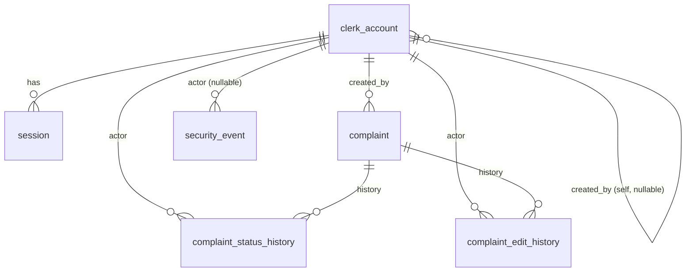

Summary: 7 tables (clerk_account, session, complaint, complaint_status_history, complaint_edit_history, rate_limit_counter, security_event), 2 enums, 12 indexes, additive-only Alembic migrations, app-level append-only guard on 3 history/event tables, no hard delete anywhere except bounded session/rate-limit sweeps (`ctid`-bounded, on login, on limiter rollover); complaint creation idempotent via `client_request_id`; rate limiter carries `lookup`/`login_ip`/`login_userip`/`login_user`/`detail`/`write`/`search` scopes, `detail`/`write`/`search` keyed on `user_id`; OTP consumed at login by overwriting `password_hash` with a discarded random hash, not by clearing a flag (R4-1); `login_failure` events bounded to one row per `(actor_username_hash, derived_ip, 15-min window)` and none while the `login_ip` tier is already tripped (R4-5).

# Database Schema — panchayat-complaint-tracker

rev 4 (2026-09-09), rework loop 3 (final). Binding inputs: solution-architecture.md D-B/D-D and
`## Rev 2/3/4 decisions for the API and schema` (R2-5/R2-6/R2-8/R2-11, R3-2/R3-3/R3-4/R3-7/R3-8/R3-9/R3-10,
R4-1/R4-2/R4-3/R4-4/R4-5/R4-6),
security-architecture.md §1/§3/§7, backend-architecture.md §3/§5/§6/§7-10, business-rules.md BR-001..BR-016,
ADR-005/006/007/008/016/017/020/021/022. PostgreSQL 17, SQLAlchemy 2.x sync models (data-api-architect
owns the fields), Alembic migrations. Closes SEC-F2, SEC-F4, SEC-F14, ARCH-F5, REL-F1, REL-F5, PERF-F4
(rework loop 1), SEC-S3, SEC-S4, SEC-S5, SEC-S6, SEC-S10, ARCH-F5, ARCH-F2/R3-9, PERF-F5 (rework loop 2),
and ARCH-F1/SEC-F2 (R4-1), SEC-F3 (R4-2), ARCH-F2 (R4-3), ARCH-F3 (R4-4), ARCH-F4/SEC-F4 (R4-5), SEC-F3
(R4-6) (rework loop 3) on the schema side.

## ERD (text/mermaid)



`rate_limit_counter` has no FK — it lives on a separate AUTOCOMMIT engine and must never join the
request `Session` (backend-architecture §5).

## Enums

```sql
CREATE TYPE complaint_status AS ENUM ('new','in_progress','resolved','rejected','closed');
-- Legal transitions (BR-002, enforced in services/complaints/transitions.py, not a DB CHECK,
-- because the legal map depends on the *current* row value under a row lock, not a static rule):
--   new -> in_progress
--   in_progress -> resolved | rejected
--   resolved -> closed
--   rejected -> closed
--   closed -> (terminal)

CREATE TYPE security_event_type AS ENUM (
  'login_success', 'login_failure', 'account_created',
  'password_reset_issued', 'throttle_lookup', 'throttle_login', 'throttle_detail', 'throttle_write',
  'throttle_search', 'account_unlocked'
);
-- 'throttle_detail' (R2-7/SEC-F4), 'throttle_write' (rev 3, R3-3/SEC-S4) and 'throttle_search'
-- (rev 4, R4-6 -- the new `search` scope's own crossing event): one row per (scope,key,window_start)
-- crossing, never per refused request (R3-8). 'login_failure' rows are separately bounded: at most
-- one per (actor_username_hash, derived_ip, 15-min window), and none at all once the login_ip tier
-- is past its limit (rev 4, R4-5) -- see security_event retention notes below. Column names are
-- exactly event_type/actor_user_id/actor_username_hash/target_user_id/derived_ip/reason_code/created_at
-- everywhere (rev 3, R3-7/ARCH-F5) -- api-contract.md and error-catalog.md use these names.
-- Each enum value ships in its own migration ahead of any code that writes it.
```

`public_update` (the citizen-facing enum in the API response) is **not a DB column** — it is derived
1:1 from `complaint.status` in `services/lookup.py` at read time (security-architecture §7, backend
lifecycle step 7). Keeping it out of the schema means the public wording can change without a
migration. See api-contract.md for the value mapping.

## Entities

### clerk_account
| Column | Type | Nullable | Default | Notes |
|---|---|---|---|---|
| id | BIGSERIAL | no | — | PK, internal only, never exposed as a public identifier |
| username | VARCHAR(30) | no | — | UNIQUE; `CHECK (username ~ '^[A-Za-z0-9_]{3,30}$')` (BR-016) |
| password_hash | TEXT | no | — | Argon2id encoded string (`argon2-cffi`); never the raw/OTP value |
| is_admin_clerk | BOOLEAN | no | `false` | BR-013 role flag; no other role exists |
| must_change_password | BOOLEAN | no | `true` | Forced on create/reset (BR-016); cleared on successful voluntary/forced change |
| created_at | TIMESTAMPTZ | no | `now()` | |
| updated_at | TIMESTAMPTZ | no | `now()` | Touched on password change |
| created_by | BIGINT | yes | — | FK → clerk_account.id, `ON DELETE SET NULL`; NULL for the bootstrap admin (FR-015) |
| password_is_otp | BOOLEAN | no | `false` | **rev 2 (R2-5/SEC-F2), consumption corrected rev 4 (R4-1) — supersedes rev 3's flag-only clearing, which left the OTP's own hash valid.** True whenever `password_hash` is a one-time password; set `true` by `services.accounts.issue_otp`. Set `false` by whichever comes first: (a) the **login** that uses it — in the same transaction the server also **overwrites `password_hash` with `argon2.hash(secrets.token_bytes(32))`**, a freshly generated 256-bit value used once and immediately discarded (never stored, returned, or logged); `must_change_password` stays `true`, and the session is confined to change-password/logout/`GET /api/session`; or (b) a successful password **change**. A **second** login with the same OTP after (a) now fails Argon2 verification against the throwaway hash and returns the generic **`401 not_authenticated`** (R4-4 — there is no `invalid_credentials` code in this system) — this is what makes single-use actually true, not a flag that left the credential live |
| password_set_at | TIMESTAMPTZ | no | `now()` | **rev 2 (R2-5/SEC-F2).** Written every time `password_hash` changes (create, reset, voluntary/forced change). Login checks `NOT password_is_otp OR now() < password_set_at + OTP_EXPIRY_HOURS` *after* the Argon2 verify succeeds; failing that check returns `otp_expired` (401), never a session. **Rev 4 (R4-1):** this branch only fires for an **un-consumed** OTP — once a login has consumed one (row above), `password_is_otp` is already `false`, so the expiry check cannot fire on it again |

No delete/deactivate column exists — offboarding is the R2-10 documented workaround (admin resets and
discards the OTP, which revokes every session and leaves a 72 h-expiring, unusable credential), not a
schema column.

### session
| Column | Type | Nullable | Default | Notes |
|---|---|---|---|---|
| id | BIGSERIAL | no | — | PK |
| user_id | BIGINT | no | — | FK → clerk_account.id, `ON DELETE CASCADE`; NOT NULL — no anonymous rows (ADR-007) |
| token_hash | CHAR(64) | no | — | UNIQUE; SHA-256 hex of the opaque token; plaintext never stored |
| csrf_token | CHAR(64) | no | — | Session-bound CSRF secret, rotated with the row |
| created_at | TIMESTAMPTZ | no | `now()` | |
| last_seen_at | TIMESTAMPTZ | no | `now()` | Refreshed every authenticated request |
| absolute_expires_at | TIMESTAMPTZ | no | — | `created_at + 9h` (SESSION_ABSOLUTE_HOURS) |
| revoked_at | TIMESTAMPTZ | yes | — | Set on logout, password change, admin reset, `reset-admin-password` CLI, or idle/absolute expiry detection |

**`user_agent_hash` removed, rev 2 (R2-8/SEC-F14).** Rev 1 wrote it and never checked it — a stored
fingerprint with no control attached. UA binding returns only together with a check and a test.
**Login issuance, rev 2 (R2-4/ADR-021):** login always inserts a new row and revokes only the row
matching the session cookie presented on the login request, if any — never every row for the user.

### complaint
| Column | Type | Nullable | Default | Notes |
|---|---|---|---|---|
| id | BIGSERIAL | no | — | PK, internal only — used in authenticated URLs (`/api/complaints/{id}`); never the public `complaint_number` (D-C) |
| complaint_number | CHAR(9) | no | — | UNIQUE; canonical 9-symbol Crockford base32 (8 body + 1 checksum, ADR-016); `CHECK (complaint_number ~ '^[0-9A-HJKMNP-TV-Z]{9}$')` |
| client_request_id | UUID | no | — | **rev 2 (R2-6/ADR-022/REL-F1).** UNIQUE; client-generated on `POST /api/complaints`. On a unique violation the service re-reads the existing row and returns it with `200` instead of inserting a second complaint — this is the complaint-creation idempotency key and is not applied anywhere else |
| citizen_name | VARCHAR(100) | no | — | `CHECK (length(trim(citizen_name)) > 0)` (BR-007, BR-014) |
| citizen_phone | VARCHAR(16) | no | — | `CHECK (citizen_phone ~ '^\+?[0-9]{7,15}$')` (BR-012) |
| description | VARCHAR(2000) | no | — | `CHECK (length(trim(description)) > 0)` (BR-006, BR-014) |
| status | complaint_status | no | `'new'` | Set automatically at creation (BR-002); never set directly by a client — only via the status-update transaction |
| created_at | TIMESTAMPTZ | no | `now()` | Immutable; edit window (FR-012) is computed from this value, never overwritten |
| updated_at | TIMESTAMPTZ | no | `now()` | Touched by status update and edit-details, inside the same transaction as the history insert |
| created_by | BIGINT | no | — | FK → clerk_account.id, `ON DELETE RESTRICT` (BR-003, audit — a clerk row can never disappear out from under a complaint it logged) |

No `deleted_at` / soft-delete column — BR-008 is absolute: there is no delete path anywhere for a
complaint row, hard or soft.

### complaint_status_history (append-only)
| Column | Type | Nullable | Default | Notes |
|---|---|---|---|---|
| id | BIGSERIAL | no | — | PK |
| complaint_id | BIGINT | no | — | FK → complaint.id, `ON DELETE RESTRICT` |
| previous_status | complaint_status | no | — | The status immediately before this change |
| new_status | complaint_status | no | — | `CHECK (new_status <> previous_status)` |
| note | VARCHAR(2000) | yes | — | Optional free-text (FR-006); clerk-only, never in the public DTO |
| actor_id | BIGINT | no | — | FK → clerk_account.id, `ON DELETE RESTRICT` |
| created_at | TIMESTAMPTZ | no | `now()` | |

### complaint_edit_history (append-only)
| Column | Type | Nullable | Default | Notes |
|---|---|---|---|---|
| id | BIGSERIAL | no | — | PK |
| complaint_id | BIGINT | no | — | FK → complaint.id, `ON DELETE RESTRICT` |
| field_name | VARCHAR(20) | no | — | `CHECK (field_name IN ('citizen_name','citizen_phone','description'))` |
| previous_value | VARCHAR(2000) | no | — | Prior value of the named field (FR-014) |
| new_value | VARCHAR(2000) | no | — | New value; `CHECK (new_value IS DISTINCT FROM previous_value)` (**rev 2, REL-F5**) — belt-and-braces: `services.complaints.edit_details` also skips any field the client resubmitted unchanged, so this row only ever exists for a real edit |
| actor_id | BIGINT | no | — | FK → clerk_account.id, `ON DELETE RESTRICT` |
| created_at | TIMESTAMPTZ | no | `now()` | |

`complaint_status_history` and `complaint_edit_history` are read together, merged and ordered by
`created_at` (then `id` as a tiebreak), to build the single Activity timeline the Complaints screen
shows (FR-011/FR-014, screen-inventory.md #4).

### rate_limit_counter (fixed-window limiter, own AUTOCOMMIT engine)
| Column | Type | Nullable | Default | Notes |
|---|---|---|---|---|
| scope | VARCHAR(20) | no | — | `'lookup'`\|`'login_ip'`\|`'login_userip'`\|`'login_user'`\|`'detail'`\|`'write'`\|`'search'` (`write` new rev 3, R3-3/SEC-S4, third route added rev 4 R4-5; `detail` re-keyed rev 3, R3-2/SEC-S3, widened rev 4 to cover `/activity` R4-2; `search` new rev 4, R4-2/R4-6 — see `key`). No "recent-success" exemption scope exists — rev 2 (SEC-F6) deleted that carve-out |
| key | VARCHAR(80) | no | — | Form depends on `scope` (rev 3, R3-2/R3-3/SEC-S10, extended rev 4 R4-2 — full PII-classified list in data-dictionary.md): derived IP (`lookup`, `login_ip`); `h(username)` (`login_user`); `h(username)\|ip` (`login_userip`); **`user_id` as text** (`detail`, `write`, `search` — re-keyed off the session hash because login mints unlimited sessions) |
| window_start | TIMESTAMPTZ | no | — | Start of the fixed 1-minute (lookup) or 15-minute (login) window, truncated |
| count | INTEGER | no | `1` | Incremented by the atomic `INSERT … ON CONFLICT … DO UPDATE … RETURNING` (backend-architecture §5) |

`PRIMARY KEY (scope, key, window_start)` — no other FK/columns; this table is deliberately outside
the append-only policy (rows for a key are deleted deterministically on window rollover, backend-
architecture §5) because it is an operational counter, not audit data.

### security_event (append-only)
| Column | Type | Nullable | Default | Notes |
|---|---|---|---|---|
| id | BIGSERIAL | no | — | PK |
| event_type | security_event_type | no | — | |
| actor_user_id | BIGINT | yes | — | FK → clerk_account.id, `ON DELETE SET NULL`; NULL for a failed login (unknown/unauthenticated actor) |
| target_user_id | BIGINT | yes | — | **rev 2 (ARCH-F5).** FK → clerk_account.id, `ON DELETE SET NULL`. The account the event is *about*, when different from the actor: `password_reset_issued` (target = the clerk whose password was reset — by an admin in-app or by the `reset-admin-password` CLI, `reason_code=operator_cli`), `account_created` (target = the new account), `account_unlocked` (target = the account whose counters were cleared). NULL for `login_success`/`login_failure`/`throttle_*`, which have no second party |
| actor_username_hash | CHAR(16) | yes | — | `h(username)` = first 16 hex chars of SHA-256(casefolded username + `USERNAME_HASH_SALT`, **rev 2 — not `SECRET_KEY`**, R2-11); used when there is no session/user row yet (e.g., login_failure) |
| derived_ip | VARCHAR(45) | yes | — | IPv6-safe length; /64-normalised per ADR-020 |
| reason_code | VARCHAR(40) | yes | — | Short code only, e.g. `bad_password`, `rate_limited` — never free text, never a password, never a complaint number |
| created_at | TIMESTAMPTZ | no | `now()` | |

## Indexes (justified by named access patterns only)

| Index | Table | Columns | Justifies |
|---|---|---|---|
| `uq_clerk_account_username` | clerk_account | UNIQUE(username) | Login lookup, BR-016 uniqueness under concurrency |
| `uq_session_token_hash` | session | UNIQUE(token_hash) | Every authenticated request's session-loader lookup |
| `ix_session_user_id` | session | (user_id) | Revoke-all on password change/admin reset (security-architecture §1) |
| `uq_complaint_number` | complaint | UNIQUE(complaint_number) | Public lookup equality query (BR-004); insert-retry uniqueness under concurrency (AC-003, ADR-016); **also** the exact-match quick-jump field on `POST /api/complaints/search` (rev 3, R3-1/ARCH-F1) — `complaint_number` is normalised to the canonical 9-symbol form and matched by equality on this same index, never `LIKE` |
| `uq_complaint_client_request_id` | complaint | UNIQUE(client_request_id) | **rev 2 (R2-6/REL-F1).** The conflict target `POST /api/complaints` relies on to detect and return a duplicate submission instead of creating a second row |
| `ix_complaint_status_created_id` | complaint | (status, created_at DESC, id DESC) | **rev 2 (PERF-F4), replaces rev 1's plain `ix_complaint_status`.** `POST /api/complaints/search` filters by `status` and keyset-paginates by `(created_at DESC, id DESC)` in the same query (FR-007, AC-005); a composite index serves both the status-filtered case and a plain status lookup (leading column), one index instead of two |
| `ix_complaint_created_id` | complaint | (created_at DESC, id DESC) | Kept alongside the composite above for the **unfiltered** search (no `status` given) — a leading `status` column can't serve a scan with no status predicate; stable under concurrent inserts (backend-architecture §10) |
| `ix_csh_complaint_created` | complaint_status_history | (complaint_id, created_at, id) | Ordered per-complaint history read, merged with edit history (FR-011) |
| `ix_ceh_complaint_created` | complaint_edit_history | (complaint_id, created_at, id) | Same, edit side (FR-014) |
| `pk_rate_limit_counter` | rate_limit_counter | PK(scope, key, window_start) | The atomic upsert's conflict target (backend-architecture §5) — this *is* the mechanism, not incidental |
| `ix_rate_limit_counter_window_start` | rate_limit_counter | (window_start) | **rev 3 (R3-10/SEC-S6).** Ships in migration 0001, not added later — the scope-agnostic sweep (`WHERE window_start < now() - interval '2 hours'`, backend-architecture §5) is an index range scan from the first request rather than a sequential scan that only gets attention after it hurts |
| `ix_security_event_created` | security_event | (created_at) | Operator review window (ADR-011 evidence trail); small table, index kept cheap |

**No trigram/GIN index on `citizen_name`/`citizen_phone`.** The clerk search control is a plain
`ILIKE '%term%'` scan inside `POST /api/complaints/search`. At pilot scale (1-5 clerks, a few hundred
complaints/month, NFR-010 no-delete) the 2-year table is ~2,000-6,000 rows — a sequential scan there is
single-digit ms, and `pg_trgm`+GIN (not in the binding stack, ADR-005/010) would be disproportionate.
Revisit only an order of magnitude past pilot scale.

## Constraints summary (every BR with a column-level rule, mapped)

| BR | Constraint |
|---|---|
| BR-001 | `uq_complaint_number`; number column never in the SQLAlchemy updatable column set |
| BR-002 | No DB CHECK (transition legality needs the current-row value under `FOR UPDATE`); enforced in `services/complaints/transitions.py` — see api-contract.md `illegal_transition` |
| BR-006 | `CHECK (length(trim(description)) > 0)` |
| BR-007 | `NOT NULL` on citizen_name, citizen_phone |
| BR-009 | No such column exists anywhere in the schema; `extra="forbid"` on every request DTO makes an injected field a 422 before it ever reaches SQL |
| BR-012 | `CHECK` regex on citizen_phone |
| BR-014 | `VARCHAR(100)` / `VARCHAR(2000)` column widths plus the same-value CHECKs |
| BR-016 | `CHECK` regex on username; password length/similarity/common-list rules are service-level only (Argon2id hashes are one-way — a DB CHECK cannot express "not similar to username" against a hash) |

### Rev 2 additions closing reviewer findings (not BR-numbered)

| Finding | Constraint |
|---|---|
| SEC-F2 | `clerk_account.password_is_otp NOT NULL DEFAULT false`, `password_set_at NOT NULL`; expiry is a service-layer check (`now() < password_set_at + OTP_EXPIRY_HOURS`), not a DB CHECK — `now()` in a CHECK is not evaluated per-query the way this needs |
| REL-F1 | `complaint.client_request_id UUID NOT NULL UNIQUE` |
| REL-F5 | `complaint_edit_history.new_value` `CHECK (new_value IS DISTINCT FROM previous_value)` |
| ARCH-F5 | `security_event.target_user_id BIGINT REFERENCES clerk_account(id) ON DELETE SET NULL` (nullable) |
| SEC-F14 | `session.user_agent_hash` column removed; `new_password`/`current_password` length caps (256) live in the API request schema, not the DB — these values are never persisted in raw form |

## Audit / append-only enforcement

Two layers, per backend-architecture §9 (data-api-architect confirms the DB layer):
1. **App-level guard (primary, always active):** a SQLAlchemy `before_execute` hook in `db/guard.py`
   raises on any `UPDATE`/`DELETE` construct against `complaint_status_history`, `complaint_edit_history`,
   or `security_event`; a grep assertion forbids `.update()`/`.delete()` calls on those names anywhere
   in `services/`/`repositories/`.
2. **DB-level hardening (best-effort):** an Alembic migration attempts `REVOKE UPDATE, DELETE ON
   complaint_status_history, complaint_edit_history, security_event FROM <app_role>`; if the platform
   provisions only one application role (no second role to run the REVOKE from), the migration logs a
   warning and continues — enforcement is then app-level only (backend-architecture §9).

`complaint` itself has **no delete route and no DELETE grant expectation** — BR-008 — but is
mutable on `status`/`updated_at` (status-update) and `citizen_name`/`citizen_phone`/`description`/
`updated_at` (edit-details, within the 7-day window), always paired with a history insert in the
same transaction (backend-architecture §9).

## Soft-delete policy

None, anywhere. BR-008 is "no hard delete"; no `deleted_at`/`is_active`-style column exists on
`complaint`. `clerk_account` likewise has no deactivation column — offboarding is the R2-10 documented
workaround (admin resets and discards the OTP), not a schema column. `session` rows are never deleted
by the request path — `revoked_at` marks them dead; only the bounded sweeps below physically delete
rows, which is operational hygiene, not a policy about user data.

## Retention and cleanup

**Complaint data (NFR-010):** retained at least 12 months with **no automatic deletion** — no purge
job, no cron, no TTL anywhere in this schema (complexity budget item 6, REJECTED). Backups (ADR-006):
Fly Managed Postgres daily platform backups (automatic); a monthly encrypted off-platform `pg_dump` on
a scheduled Fly machine is **built but dormant** until the destination is named (open item OQ-2) — the
human holds the encryption key (GATE_2 Q6). A go-live restore test into a throwaway database is
required before real citizen data is entered (ADR-006). Production data is never copied to dev, CI, or
an AI tool (ADR-006, dependency-strategy §6).

**Operational sweeps — bounded, deterministic, never a cron** (mirrors backend-architecture.md §3/§5
exactly; **rev 3, R3-9/ARCH-F2 restates the SQL in the only form PostgreSQL accepts** — there is no
`DELETE … LIMIT`, so every bound is a `ctid` sub-select, and no document may show the earlier,
non-executable form):
- **Session sweep, on every successful login** (backend §3): two `ctid`-bounded deletes on the request
  engine. The idle bound is **always** `make_interval(mins => :session_idle_minutes)` bound from the
  `SESSION_IDLE_MINUTES` setting, never a hardcoded `interval '45 minutes'`:
  ```sql
  DELETE FROM session WHERE ctid IN (SELECT ctid FROM session WHERE user_id = :uid AND
    (absolute_expires_at < now() OR last_seen_at < now() - make_interval(mins => :session_idle_minutes)
     OR revoked_at IS NOT NULL) LIMIT 100);
  DELETE FROM session WHERE ctid IN (SELECT ctid FROM session
    WHERE absolute_expires_at < now() - make_interval(days => :session_grace_days) LIMIT 200);
  ```
  first: the logging-in user's own expired/idle/revoked rows, idle bound always from
  `SESSION_IDLE_MINUTES`, never a literal interval. Second: a global `SESSION_SWEEP_GRACE_DAYS` (7)
  floor across all users. Ceiling at pilot scale: tens of rows live, low thousands ever. **Cost (rev 3,
  PERF-F5):** the sub-select on `absolute_expires_at` is scan-cheap at that bound — no index required
  for correctness or latency; fallback past that bound is an additive partial index on
  `absolute_expires_at`, not a new component.
- **Rate-limit sweep, on limiter window rollover** (backend §5), same AUTOCOMMIT engine, same form:
  ```sql
  DELETE FROM rate_limit_counter WHERE ctid IN (SELECT ctid FROM rate_limit_counter
    WHERE window_start < now() - make_interval(hours => :sweep_hours) LIMIT 500);  -- :sweep_hours = 2
  ```
  Scope-agnostic (a per-key cleanup never touches a key that never recurs); runs as an index range
  scan on `ix_rate_limit_counter_window_start` (R3-10) from the first request. Keeps the table bounded
  even after the `detail` (R2-7) and `write` (R3-3) scopes add rows.
- **`security_event` growth is bounded by write policy, not a sweep (rev 3, R3-8/SEC-S2).** Append-only
  and nothing may delete from it, so size depends on write frequency: the limiter writes at most **one
  `throttle_*` row per `(scope, key, window_start)`**, on the single request where the atomic upsert's
  `RETURNING count` first equals `limit + 1` — never one per refused request. A sustained attacker adds
  one row per window per key, not one per request, which is what keeps an unauthenticated flood from
  growing this unshrinkable table (threat #34). **`throttle_search` (rev 4, R4-6) follows the identical
  rule for the new `search` scope.**
- **`login_failure` rows are separately bounded (rev 4, R4-5/SEC-F4).** A failed login writes **at most
  one** `login_failure` row per `(actor_username_hash, derived_ip, 15-minute window)`, and **once the
  tier-1 `login_ip` counter for that key is already past its limit, no further `login_failure` row is
  written at all** — the request is refused by the short-circuit before the event service is reached
  (backend-architecture §5). Same shape as the throttle-event write rule above, applied to a different
  event type, for the same reason: an unbounded row-per-failed-login write would let a sustained
  guessing attempt grow this unshrinkable table without limit.

## Migration strategy (Alembic, additive-only)

- **Naming:** `migrations/versions/<YYYYMMDD_HHMM>_<slug>.py`; Alembic's own revision hash stays the
  primary key, the filename prefix is for human/CI readability only.
- **Additive-only rules (binding, ADR-005/D-D):** add a table, add a nullable column (or a NOT NULL
  column with a server default in the same migration), add a pilot-scale-safe index, or append an enum
  value with `ALTER TYPE ... ADD VALUE`. Never drop/rename a table/column, narrow a type, or
  remove/reorder an enum value — a one-version-behind cached frontend (D-C) and no-staging deploy (D-D)
  both depend on this. An `ADD VALUE` enum change ships in its own revision, one release ahead of any
  code that writes it. **Rev 2 applies this exactly:** two `clerk_account` columns with defaults, one
  `complaint` column (`client_request_id`, UUID-defaulted then `NOT NULL UNIQUE`), one nullable
  `security_event` column, one new CHECK, one new enum value in its own revision, one index swap (add
  the composite, drop the now-redundant plain one).
- **CI drift gate:** `alembic check` runs in CI against a Postgres service container seeded from
  `alembic upgrade head` on the previous revision, catching a model/migration mismatch before merge
  (ADR-005, ADR-009 no-staging compensating control).
- **Release command:** `alembic upgrade head` runs as the Fly release command and aborts the deploy
  on failure (D-D) — there is no separate migration step for the human to remember.
- **Rollback:** because migrations are additive-only, there is nothing to "roll back" at the schema
  level in the normal case; the actual rollback mechanism is redeploy-the-previous-image (D-D). Each
  `downgrade()` is implemented where mechanically safe (e.g., drop an index) and left as an explicit
  `NotImplementedError`-style no-op with a comment where reversing would be destructive (e.g., drop a
  column) — matching CLAUDE.md's "no destructive SQL" rule; a destructive rollback is the human's
  call, never an automated one.
- **Seed / bootstrap:** no seed migration exists. The very first admin `clerk_account` row is created
  by the `bootstrap-admin` CLI (FR-015, AC-019) at deploy time, idempotent (no-op if an admin already
  exists) — never a fixture, never a credential committed to the repo (backend-architecture §12).

## Compact DDL sketch

```sql
CREATE TABLE clerk_account (
  id              BIGSERIAL PRIMARY KEY,
  username        VARCHAR(30) NOT NULL UNIQUE
                    CHECK (username ~ '^[A-Za-z0-9_]{3,30}$'),
  password_hash   TEXT NOT NULL,
  is_admin_clerk  BOOLEAN NOT NULL DEFAULT false,
  must_change_password BOOLEAN NOT NULL DEFAULT true,
  password_is_otp BOOLEAN NOT NULL DEFAULT false,      -- rev 2, R2-5/SEC-F2
  password_set_at TIMESTAMPTZ NOT NULL DEFAULT now(),  -- rev 2, R2-5/SEC-F2
  created_at      TIMESTAMPTZ NOT NULL DEFAULT now(),
  updated_at      TIMESTAMPTZ NOT NULL DEFAULT now(),
  created_by      BIGINT REFERENCES clerk_account(id) ON DELETE SET NULL
);

CREATE TABLE session (
  id                    BIGSERIAL PRIMARY KEY,
  user_id               BIGINT NOT NULL REFERENCES clerk_account(id) ON DELETE CASCADE,
  token_hash            CHAR(64) NOT NULL UNIQUE,
  csrf_token            CHAR(64) NOT NULL,
  created_at            TIMESTAMPTZ NOT NULL DEFAULT now(),
  last_seen_at          TIMESTAMPTZ NOT NULL DEFAULT now(),
  absolute_expires_at   TIMESTAMPTZ NOT NULL,
  revoked_at            TIMESTAMPTZ
  -- no user_agent_hash — removed rev 2, R2-8/SEC-F14
);
CREATE INDEX ix_session_user_id ON session(user_id);

CREATE TYPE complaint_status AS ENUM ('new','in_progress','resolved','rejected','closed');

CREATE TABLE complaint (
  id                 BIGSERIAL PRIMARY KEY,
  complaint_number   CHAR(9) NOT NULL UNIQUE
                      CHECK (complaint_number ~ '^[0-9A-HJKMNP-TV-Z]{9}$'),
  client_request_id  UUID NOT NULL UNIQUE,             -- rev 2, R2-6/REL-F1
  citizen_name       VARCHAR(100) NOT NULL CHECK (length(trim(citizen_name)) > 0),
  citizen_phone      VARCHAR(16) NOT NULL CHECK (citizen_phone ~ '^\+?[0-9]{7,15}$'),
  description        VARCHAR(2000) NOT NULL CHECK (length(trim(description)) > 0),
  status             complaint_status NOT NULL DEFAULT 'new',
  created_at         TIMESTAMPTZ NOT NULL DEFAULT now(),
  updated_at         TIMESTAMPTZ NOT NULL DEFAULT now(),
  created_by         BIGINT NOT NULL REFERENCES clerk_account(id) ON DELETE RESTRICT
);
CREATE INDEX ix_complaint_status_created_id ON complaint(status, created_at DESC, id DESC); -- rev 2, PERF-F4, replaces ix_complaint_status
CREATE INDEX ix_complaint_created_id ON complaint(created_at DESC, id DESC);

CREATE TABLE complaint_status_history (
  id               BIGSERIAL PRIMARY KEY,
  complaint_id     BIGINT NOT NULL REFERENCES complaint(id) ON DELETE RESTRICT,
  previous_status  complaint_status NOT NULL,
  new_status       complaint_status NOT NULL CHECK (new_status <> previous_status),
  note             VARCHAR(2000),
  actor_id         BIGINT NOT NULL REFERENCES clerk_account(id) ON DELETE RESTRICT,
  created_at       TIMESTAMPTZ NOT NULL DEFAULT now()
);
CREATE INDEX ix_csh_complaint_created ON complaint_status_history(complaint_id, created_at, id);

CREATE TABLE complaint_edit_history (
  id               BIGSERIAL PRIMARY KEY,
  complaint_id     BIGINT NOT NULL REFERENCES complaint(id) ON DELETE RESTRICT,
  field_name       VARCHAR(20) NOT NULL
                     CHECK (field_name IN ('citizen_name','citizen_phone','description')),
  previous_value   VARCHAR(2000) NOT NULL,
  new_value        VARCHAR(2000) NOT NULL
                     CHECK (new_value IS DISTINCT FROM previous_value),  -- rev 2, REL-F5
  actor_id         BIGINT NOT NULL REFERENCES clerk_account(id) ON DELETE RESTRICT,
  created_at       TIMESTAMPTZ NOT NULL DEFAULT now()
);
CREATE INDEX ix_ceh_complaint_created ON complaint_edit_history(complaint_id, created_at, id);

CREATE TABLE rate_limit_counter (
  scope        VARCHAR(20) NOT NULL,
  key          VARCHAR(80) NOT NULL,
  window_start TIMESTAMPTZ NOT NULL,
  count        INTEGER NOT NULL DEFAULT 1,
  PRIMARY KEY (scope, key, window_start)
);
CREATE INDEX ix_rate_limit_counter_window_start ON rate_limit_counter(window_start); -- rev 3, R3-10/SEC-S6, ships in migration 0001

CREATE TYPE security_event_type AS ENUM (
  'login_success','login_failure','account_created',
  'password_reset_issued','throttle_lookup','throttle_login','throttle_detail','throttle_write',
  'throttle_search','account_unlocked'  -- 'throttle_search' rev 4, R4-6
);

CREATE TABLE security_event (
  id                    BIGSERIAL PRIMARY KEY,
  event_type            security_event_type NOT NULL,
  actor_user_id         BIGINT REFERENCES clerk_account(id) ON DELETE SET NULL,
  target_user_id        BIGINT REFERENCES clerk_account(id) ON DELETE SET NULL,  -- rev 2, ARCH-F5
  actor_username_hash   CHAR(16),
  derived_ip            VARCHAR(45),
  reason_code           VARCHAR(40),
  created_at            TIMESTAMPTZ NOT NULL DEFAULT now()
);
CREATE INDEX ix_security_event_created ON security_event(created_at);
```

## Transactions and concurrency

| Operation | Boundary | Mechanism |
|---|---|---|
| Complaint creation (idempotent, **rev 2 R2-6**) | One transaction: `INSERT` with `client_request_id` + generated number; on a number unique-violation, retry with a fresh number inside a savepoint, max 5 attempts; on a `client_request_id` unique-violation, **abort the insert and re-read** the existing row by that id, return it with `200` (no second row, no retry) | AC-003, ADR-016, REL-F1/ADR-022 |
| Status update | One transaction: `SELECT … FOR UPDATE` on the complaint row → validate transition (BR-002) → `UPDATE complaint SET status, updated_at` → `INSERT complaint_status_history` → commit | BR-011, ADR-017 |
| Edit details | Same shape as status update, targeting the changed columns and `complaint_edit_history`; unchanged fields are skipped by the service and would fail the new `CHECK` if attempted anyway (REL-F5) | FR-012/FR-014 |
| Concurrent writers (BR-011) | The row lock serialises the two transactions; the later one wins current `status`/columns; **both** history rows persist regardless of which "wins" | AC-014 |
| Account create/reset/OTP issue | One transaction: `INSERT`/`UPDATE clerk_account` (sets `password_is_otp=true`, `password_set_at=now()`) → revoke-all `UPDATE session SET revoked_at = now() WHERE user_id = … AND revoked_at IS NULL` (reset only) → `INSERT security_event` (`target_user_id` = the affected account) | BR-016, R2-5, ARCH-F5 |
| Password change (self) | One transaction: verify current password → `UPDATE clerk_account SET password_hash=…, password_is_otp=false, password_set_at=now(), must_change_password=false` → revoke-all sessions → issue one fresh row | R2-5/SEC-F2 |
| Login | Verify Argon2 hash → OTP-expiry check for an **un-consumed** OTP (`otp_expired` if failed) → **if `password_is_otp` and still in date, in the same transaction: `UPDATE clerk_account SET password_hash = argon2.hash(secrets.token_bytes(32)), password_is_otp = false` — the generated 256-bit value is discarded immediately (never stored/returned/logged); `must_change_password` stays `true` (rev 4, R4-1 — supersedes rev 3's flag-only clear, which left the OTP's own hash valid and usable a second time)** → session sweep (retention section) → `INSERT session` (new row) → revoke **only** the presented cookie's row, if any. A second login with the same (now-consumed) OTP fails Argon2 verification and returns the generic `401 not_authenticated` (R4-4) | R2-4/ADR-021, R4-1 |
| Rate limiter | Single atomic statement on the dedicated AUTOCOMMIT engine, never inside the request's transaction; scopes now include `detail` (R2-7, re-keyed `user_id` rev 3 R3-2) and `write` (rev 3, R3-3) | backend-architecture §5 |
| Uniqueness under concurrency | `complaint_number`, `client_request_id`: DB `UNIQUE` + insert-retry/re-read (above). `username`: DB `UNIQUE`; a concurrent duplicate raises `IntegrityError` → mapped to `username_taken` (409) | BR-001, BR-016, REL-F1 |

## Self-audit

- Every BR with a data-shape implication has a DB constraint, an API validation, or both (table above);
  BR-002/003/008/010/011/013/015 are service/API-layer by design and cross-referenced to api-contract.md.
- Every FK states an `ON DELETE` policy (RESTRICT for audit-linked rows, CASCADE for session→user, SET
  NULL for nullable self/actor/target references, including the new `target_user_id`).
- Every unique rule (`complaint_number`, `client_request_id`, `username`, session `token_hash`) holds
  under concurrency via a DB-level `UNIQUE` constraint, not an application-only check.
- No index exists without a named access pattern (public lookup + exact-match search jump,
  status-filtered keyset pagination, idempotent-create conflict target, per-complaint history read,
  limiter conflict target and sweep scan, event review).
- Rev 2 findings closed here: SEC-F2, SEC-F4, SEC-F14, ARCH-F5, REL-F1, REL-F5, PERF-F4.
- Rev 3 findings closed here: SEC-S3/SEC-S4 (`detail`/`write` scopes keyed on `user_id`), SEC-S5/R3-4
  (OTP consumed at login, in-transaction), SEC-S6/R3-10 (`window_start` index in migration 0001),
  SEC-S2/R3-8 (one throttle event per window, reflected in retention/growth notes), ARCH-F2/R3-9
  (sweep SQL restated in the only form PostgreSQL accepts), ARCH-F5/R3-7 (security_event column names
  confirmed against api-contract.md), PERF-F5 (session sweep scan-cost note + partial-index fallback).
- Rev 4 findings closed here: ARCH-F1/SEC-F2/R4-1 (OTP consumed by destroying `password_hash` in the
  login transaction, not by clearing a flag), SEC-F3/R4-2 (`search` scope added, `detail` widened to
  cover `/activity`), ARCH-F2/R4-3 (`POST /api/complaints` counted against both `write` and `detail`
  pre-handler — see api-contract.md), ARCH-F3/R4-4 (`invalid_credentials` removed everywhere; every
  failed login is `401 not_authenticated`), ARCH-F4/SEC-F4/R4-5 (`reset-password` joins `write`;
  `login_failure` growth bounded), SEC-F3/R4-6 (`throttle_search` enum value).
